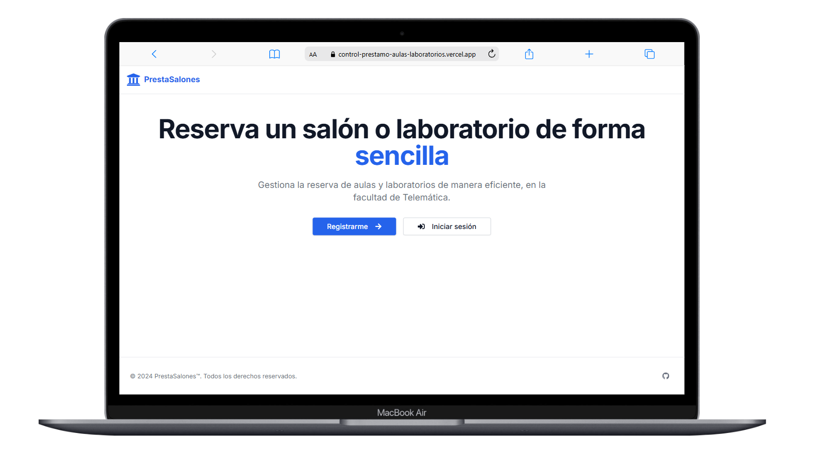

# Sistema de Control de Préstamos de Laboratorios y Aulas 🎓💻

Este sistema permite a los estudiantes y profesores de la Facultad de Telemática de la Universidad de Colima reservar laboratorios y aulas de forma rápida y sencilla, llevando un control automatizado de la disponibilidad y el uso de estos espacios.

## Funcionalidades Principales

- **Reserva de Espacios**: Reserva laboratorios y aulas con solo unos clics.
- **Calendario de Disponibilidad**: Consulta la disponibilidad en tiempo real.
- **Gestión de Usuarios**: Controla el acceso de estudiantes, profesores y administradores.
- **Notificaciones**: Recibe confirmaciones y recordatorios de tus reservas.
- **Historial de Reservas**: Revisa un registro de todas las reservas realizadas para un seguimiento detallado.

Este sistema simplifica y optimiza el uso de recursos, asegurando una experiencia de reserva fluida y eficiente para toda la comunidad académica. ✨
